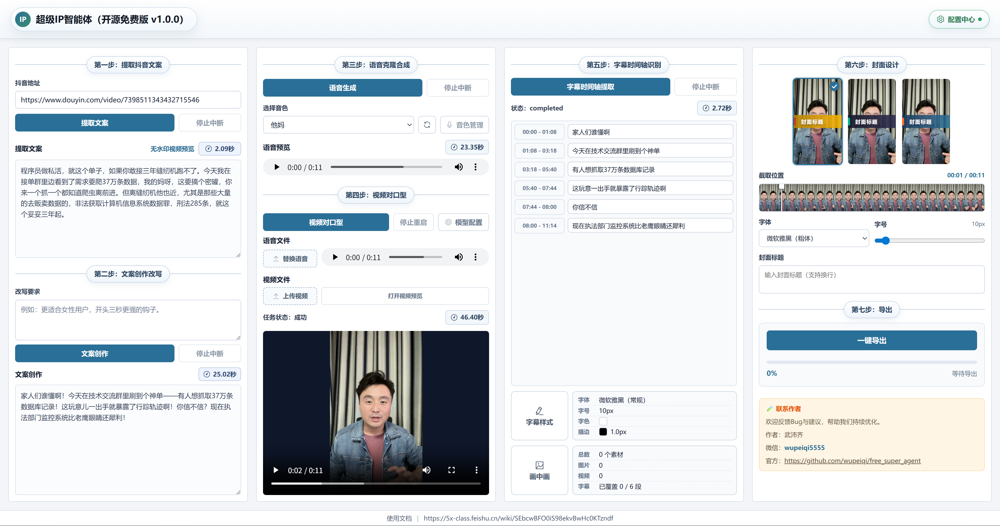

# 超级IP智能体（开源免费版）

- 作者：武沛齐
- 微信：wupeiqi5555

遇到问题或有功能建议，欢迎提 Issue。



一个把抖音爆款视频改写成自己成品视频的桌面工具。粘一条抖音链接进来，走完文案改写、声音克隆、视频对口型、字幕、封面、烧制导出，产出可以直接发布的竖屏视频。

## 它能做什么

| 步骤               | 做什么                                                   |
| ------------------ | -------------------------------------------------------- |
| 一、提取抖音文案   | 粘贴抖音链接，自动下载无水印视频并把口播内容转成文字     |
| 二、文案创作改写   | 按你的要求把原文案改写成自己的脚本                       |
| 三、语音克隆合成   | 录一段或上传一段音色样本，用你的声音把文案读出来         |
| 四、视频对口型     | 把合成的语音和一段人物视频合成口型匹配的视频             |
| 五、字幕时间轴识别 | 自动识别出带时间轴的字幕，可以逐条改字、调字体和描边样式 |
| 六、封面设计       | 从视频里抽一帧做底图，填标题、选排版风格，生成封面图     |
| 七、导出           | 把字幕烧进画面，叠上画中画，封面作首帧，输出成品         |

第四步是导出的前提。没有对口型生成的视频，后面的字幕和导出都没法进行。

## 下载安装

到本仓库的 [Releases](../../releases) 页面下载最新版本：

| 文件                              | 适用系统                                |
| --------------------------------- | --------------------------------------- |
| `SuperAgent-vX.Y.Z-win-x64.exe`   | Windows 10/11 64 位，免安装，双击就能用 |
| `SuperAgent-vX.Y.Z-mac-arm64.dmg` | macOS，M 系列芯片                       |

Intel 芯片的 Mac 装不了，苹果的 Rosetta 只能反向兼容。

**首次打开会被系统拦下**，因为安装包没有花钱买签名证书。

macOS：把程序拖进「应用程序」后，到「系统设置 → 隐私与安全性」页面底部点「仍要打开」。如果那里没出现相关提示，在终端执行下面这行，然后重新打开：

```bash
xattr -dr com.apple.quarantine "/Applications/免费超级IP智能体.app"
```

Windows：SmartScreen 提示「未知发布者」时，点「更多信息 → 仍要运行」。

## 开始使用前

**1. 完成模力方舟授权**

打开程序，点右上角**配置中心**，在弹出的窗口里登录[模力方舟](https://moark.com)账号，程序会自动拿到调用凭据。抖音提取、文案改写、语音合成、字幕识别都依赖它，没授权会一直提示。

配置中心里也能看到今天还剩多少免费调用次数。

**2. 准备对口型算力（只有第四步需要）**

对口型模型需要 GPU，得自己部署一个服务，两种方式任选：

- 本机部署，显存 8G 以上，永久免费
- 租云主机部署，大约 ¥3/小时

部署好之后在第四步的配置弹窗里填上服务地址（形如 `http://127.0.0.1:8383`）。

详细步骤见[独享算力部署指南](https://5x-class.feishu.cn/wiki/AjBXwM1zIidNKTkkFGocqEqWnLg)。

## 导出的成品

第七步选好目录后，程序会在里面新建一个 `渲染导出_时间戳` 文件夹，最多放三个文件：

- 对口型原视频,始终导出
- 成品视频,配了字幕或画中画才会渲染
- 封面图,填了封面标题才会导出

## 常见问题

**一直提示要先去配置中心授权**

模力方舟的登录状态过期了，重新点一次配置中心的授权即可。访问令牌本身很久才失效，但登录态失效会影响上传音色样本。

**Windows 提示找不到 ffmpeg.exe**

杀毒软件把它拦了。把程序所在的文件夹加进杀毒软件的白名单或排除项，然后重开程序。

**macOS 连不上局域网里的对口型服务**

macOS 15 开始，访问局域网需要单独授权。首次连接时按弹窗允许，或者去「系统设置 → 隐私与安全性 → 本地网络」把本程序打开。填 `127.0.0.1` 连本机服务不受这个限制。

**对口型提交后报服务器忙碌**

算力服务一次只能跑一个任务，等当前任务结束再提交。

**抖音链接提取失败**

先确认链接还能正常打开。抖音的接口时常调整，如果链接没问题但一直失败，可以到 Issues 反馈。

## 参与开发

需要 Node.js 24：

```bash
npm install
npm run dev
```

## 许可说明

程序内置的 `ffmpeg-static` 采用 GPL-3.0 许可，分发时需遵守相应条款。`src/assets/fonts/` 下的字体请自行确认商用授权。
